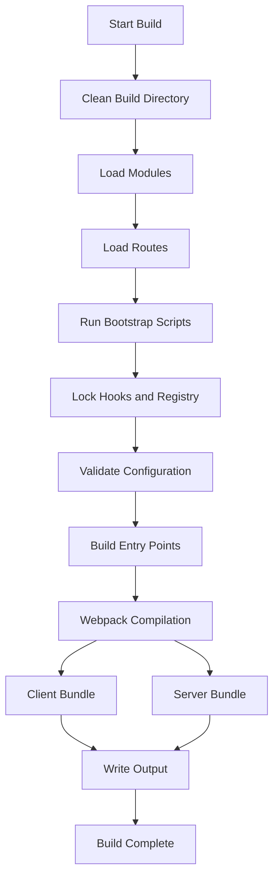

## Overview

The `evershop build` command compiles and optimizes your EverShop application for production deployment. It creates minified, optimized bundles for both client and server code.

## Usage

```bash
evershop build
```

## What It Does

### 1. Clean Build Directory

Removes previous build artifacts:

```javascript
// Removes and recreates .evershop/build/
if (existsSync(path.resolve(CONSTANTS.BUILDPATH))) {
  rmSync(path.resolve(CONSTANTS.BUILDPATH), { recursive: true });
  mkdirSync(path.resolve(CONSTANTS.BUILDPATH));
}
```

### 2. Load Modules

Loads core modules and extensions:

- Scans `src/modules/` directory
- Loads enabled extensions
- Initializes module routes
- Loads GraphQL schemas

### 3. Run Bootstrap Scripts

Executes module bootstrap scripts:

```javascript
for (const module of modules) {
  await loadBootstrapScript(module, {
    command: 'build',
    env: 'production',
    process: 'main'
  });
}
```

### 4. Build Entry Points

Generates entry files for webpack:

- Creates client entry points for each route
- Creates server entry points
- Generates component manifests

### 5. Webpack Compilation

Compiles and optimizes:

- **Client bundles**: Minified JavaScript for browser
- **Server bundles**: Optimized Node.js code
- **CSS bundles**: Minified and extracted stylesheets
- **Assets**: Optimized images and static files

## Build Output

The build process creates files in `.evershop/build/`:

```
.evershop/build/
├── client/
│   ├── [route-id].js          # Client-side bundles
│   ├── [route-id].css         # Extracted CSS
│   └── vendors/
│       └── vendor-[hash].js   # Third-party code
├── server/
│   ├── [route-id].js          # Server-side bundles
│   └── index.js               # Server entry
└── public/
    └── assets/                # Optimized static assets
```

## Build Configuration

### Environment

Build runs with production environment:

- `NODE_ENV=production`
- `ALLOW_CONFIG_MUTATIONS=false`
- Configuration is locked and validated

### Webpack Settings

Production webpack configuration:

```javascript
{
  mode: 'production',
  optimization: {
    minimize: true,
    splitChunks: {
      chunks: 'all',
      cacheGroups: {
        vendor: {
          test: /[\\/]node_modules[\\/]/,
          name: 'vendors'
        }
      }
    }
  }
}
```

## Optimization Features

### Code Splitting

Automatically splits code:

- Vendor bundles (third-party libraries)
- Route-specific bundles
- Shared component bundles

### Minification

Minifies all assets:

- JavaScript: SWC minifier
- CSS: CleanCSS
- HTML: HTML minifier

### Tree Shaking

Removes unused code:

- Dead code elimination
- Unused exports removed
- Optimized imports

### Asset Optimization

Optimizes static assets:

- Image compression
- Font subsetting
- SVG optimization

## Build Time

Typical build times:

- **Small project**: 1-2 minutes
- **Medium project**: 2-4 minutes
- **Large project**: 4-8 minutes

Factors affecting build time:

- Number of routes
- Number of components
- Number of dependencies
- Custom modules and extensions

## Build Process Flow



## Configuration Validation

The build process validates your configuration:

```javascript
validateConfiguration(config);
```

Common validation checks:

- Database configuration
- System settings
- Module configurations
- Required environment variables

## Module Bootstrap

Bootstrap scripts can perform build-time tasks:

```javascript
// modules/my-module/bootstrap.js
export default ({ config, command, env, process }) => {
  if (command === 'build') {
    // Build-time initialization
    console.log('Building my-module');
  }
};
```

## Advanced Options

### Skip Minification

For faster builds during testing:

```bash
evershop build -- --skip-minify
```

### Custom Build Path

Change build output directory:

```json
// config/default.json
{
  "system": {
    "build_path": ".evershop/build"
  }
}
```

## Production Checklist

Before building for production:

- [ ] Set production environment variables
- [ ] Update `config/production.json`
- [ ] Test database connection
- [ ] Review security settings
- [ ] Check API endpoints
- [ ] Verify payment gateway configuration
- [ ] Test email configuration

## Troubleshooting

### Build Fails with Module Error

```
Error: Cannot find module 'xyz'
```

**Solution**: Install missing dependencies:

```bash
npm install
```

### Out of Memory Error

```
JavaScript heap out of memory
```

**Solution**: Increase Node.js memory:

```bash
NODE_OPTIONS="--max-old-space-size=4096" evershop build
```

### Webpack Compilation Error

```
ERROR in ./src/components/Component.jsx
```

**Solution**: Fix syntax errors in the reported file.

### Configuration Validation Error

```
Configuration validation failed
```

**Solution**: Check `config/default.json` for required fields.

## Build Output Logs

Example build output:

```
$ evershop build

Cleaning build directory...
✓ Build directory cleaned

Loading modules...
✓ 8 core modules loaded
✓ 2 extensions loaded

Running bootstrap scripts...
✓ Bootstrap scripts completed

Validating configuration...
✓ Configuration valid

Building entry points...
✓ 45 entry points created

Compiling with webpack...
✓ Client bundle compiled (2.5 MB)
✓ Server bundle compiled (1.2 MB)

Build completed in 3m 24s
```

## Next Steps

After building:

1. **Start production server**: `evershop start`
2. **Deploy to hosting**: Upload build artifacts
3. **Monitor logs**: Check for runtime errors

## Related Commands

- `evershop dev` - Development server
- `evershop start` - Start production server
- `evershop install` - Initial setup

## Performance Tips

### Faster Builds

- Use SSD for build directory
- Increase Node.js memory limit
- Use build caching
- Minimize custom webpack configuration

### Smaller Bundles

- Remove unused dependencies
- Use dynamic imports for large components
- Enable tree shaking
- Optimize images before building

## CI/CD Integration

Example GitHub Actions workflow:

```yaml
name: Build

on:
  push:
    branches: [main]

jobs:
  build:
    runs-on: ubuntu-latest
    steps:
      - uses: actions/checkout@v2
      - uses: actions/setup-node@v2
        with:
          node-version: '18'
      - run: npm install
      - run: npm run build
      - uses: actions/upload-artifact@v2
        with:
          name: build
          path: .evershop/build/
```
